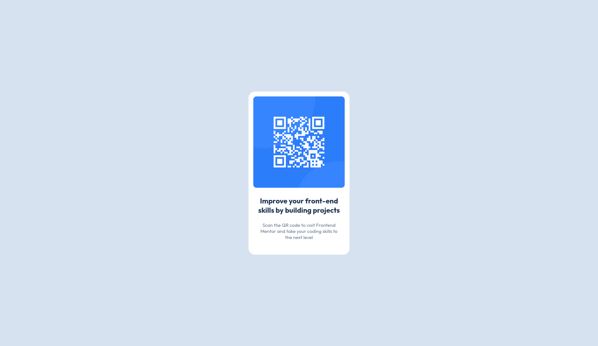

# Frontend Mentor - QR code component solution

This is a solution to the [QR code component challenge on Frontend Mentor](https://www.frontendmentor.io/challenges/qr-code-component-iux_sIO_H). Frontend Mentor challenges help you improve your coding skills by building realistic projects. 

## Table of contents

- [Overview](#overview)
  - [Screenshot](#screenshot)
  - [Links](#links)
- [My process](#my-process)
  - [Built with](#built-with)
  - [Continued development](#continued-development)
- [Author](#author)

## Overview

### Screenshot

### Links

- Solution URL: [https://github.com/akil4/qr-code-component](https://github.com/akil4/qr-code-component)
- Live Site URL: [https://akil4.github.io/qr-code-component](https://akil4.github.io/qr-code-component/)

## My process

### Built with

- Semantic HTML5 markup
- CSS custom properties
- Flexbox
- Mobile-first workflow
- [Google Fonts](https://fonts.google.com) - For fonts

### Continued development

I would like to develop this project as a random qr generator or a simple qr-code generator.

## Author

- Website - [Akil](https://akil4.vercel.app)
- Frontend Mentor - [@akil4](https://www.frontendmentor.io/profile/akil4)
- LinkedIn - [Akil S](https://www.linkedin.com/in/akil4/)